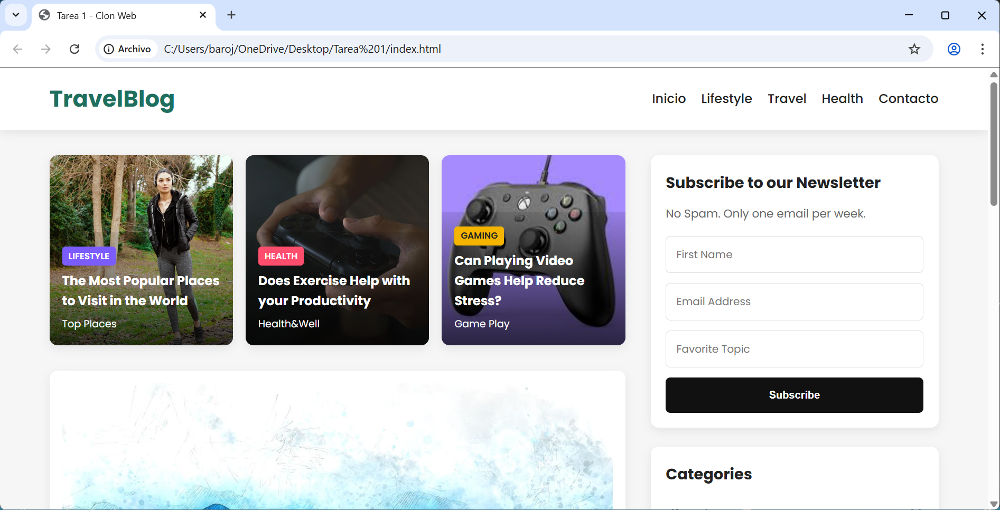
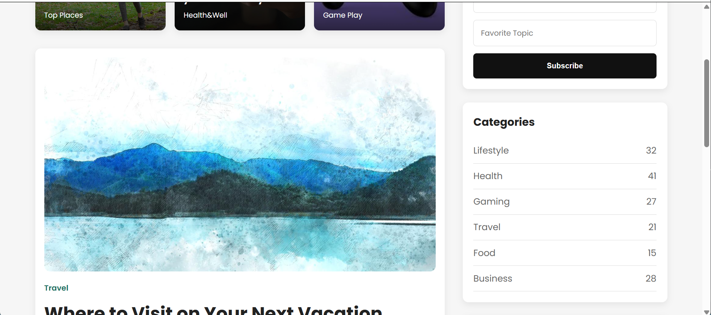
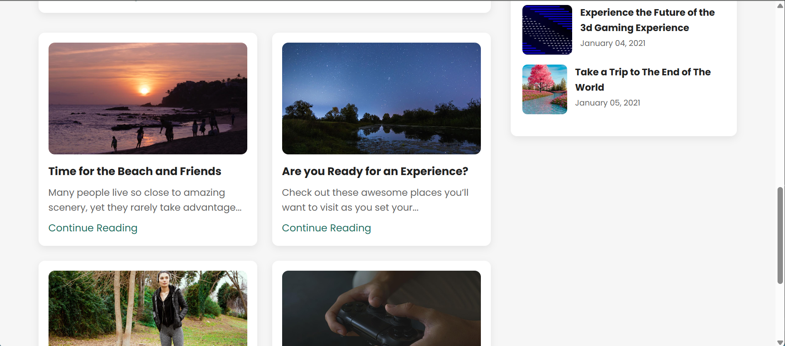

# Tarea 1 - Clon Web

**Nombre del estudiante:** Bryan Rojas 
**Carne:** C16913
**Curso:** Multimedios 

## Descripción
Este proyecto consiste en recrear la sección principal de un sitio web real utilizando únicamente HTML semántico y CSS puro, sin frameworks ni JavaScript.

## Tecnologías utilizadas
- HTML5
- CSS3

## Estructura semántica
- header
- nav
- main
- section
- article
- aside
- footer

## Capturas
## **Original**

### Resultado final

